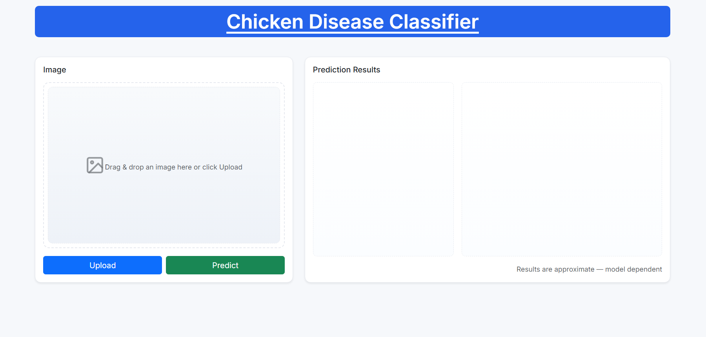
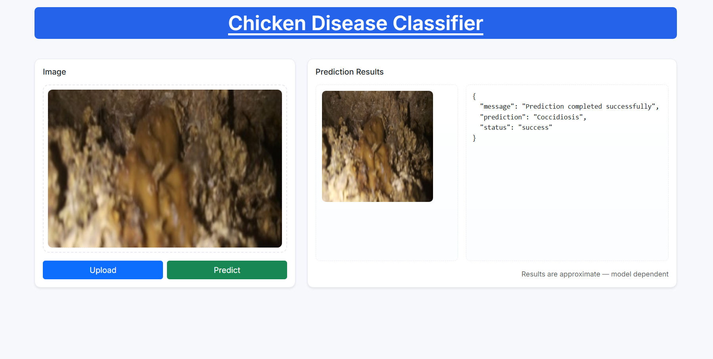

# Chicken Disease Classification

CNN-based classifier to detect Coccidiosis vs Healthy from chicken fecal images. The project is production-lean with modular pipelines, configuration-driven training, DVC for reproducibility, and a minimal Flask app for serving predictions.



## Highlights
- VGG16 backbone with configurable head (see `params.yaml`)
- Reproducible training using DVC stages (`dvc.yaml`)
- Clean component/pipeline layout under `src/cnnClassifier`
- Flask UI and JSON API (`app.py`, `templates/`, `static/`)
- Metrics tracked in `scores.json`

---

## Quick Start

Prerequisites
- Python 3.8 or higher
- Git
- DVC (pip install dvc)

On Windows PowerShell:

```powershell
# 1) Create and activate a virtual environment
python -m venv .venv
./.venv/Scripts/Activate.ps1

# 2) Install dependencies
python -m pip install --upgrade pip
pip install -r requirements.txt

# 3) Reproduce the full pipeline (data -> model)
dvc repro

# 4) Optional: visualize pipeline graph
dvc dag
```

Alternatively, you can run the full training pipeline directly:

```powershell
python main.py
```

Artifacts (datasets, models, logs) are produced under the `artifacts/` directory as configured in `config/config.yaml`.

---

## Serve the Model (Flask)

Run the web app with UI and JSON endpoint:

```powershell
python app.py
```

- UI: open http://127.0.0.1:8080/ and upload an image.
- API: `POST /predict` with JSON body `{ "image": "<base64>" }`.

Minimal request example:

```json
{
	"image": "<base64-encoded-image>"
}
```

Response shape:

```json
[
	{ 
        "prediction": "Healthy | Coccidiosis", 
        "status": "success", 
        "message": "Prediction completed successfully" 
    },
	{ "image": "<echoed-input-as-base64>" }
]
```

---

## Configuration

- Pipeline and I/O paths: `config/config.yaml`
- Hyperparameters: `params.yaml`
- DVC stages: `dvc.yaml`
- Logs: `logs/running_logs.log`

Model details (default):
- Base: VGG16 (Keras Applications)
- Input size: `IMAGE_SIZE` from `params.yaml` (default: 224x224x3)
- Top: Flatten + Dense(softmax, `CLASSES`)
- Optimizer: SGD(learning_rate = `LEARNING_RATE`)
- Training config: `BATCH_SIZE`, `EPOCHS`, `AUGMENTATION`

---

## Project Structure

```
.
├── app.py                         # Flask app (UI + API)
├── main.py                        # Run full training pipeline sequentially
├── dvc.yaml                       # DVC stages (ingestion, base, train, eval)
├── params.yaml                    # Hyperparameters
├── config/config.yaml             # Paths and stage configs
├── src/cnnClassifier/             # Components, pipelines, utils
│   ├── components/                # data_ingestion, prepare_base_model, training, evaluation, callbacks
│   ├── config/                    # Configuration management
│   ├── constants/                 # Constant values (e.g., config and params file path)
│   ├── entity/                    # Data classes for configs
│   ├── pipeline/                  # stage_01..04 + predict.py
│   ├── utils/                     # common helpers (e.g., base64 decode)
│   └── ...
├── artifacts/                     # Data + models produced by stages
│   ├── data_ingestion/Chicken-fecal-images/{Coccidiosis,Healthy}/
│   ├── prepare_base_model/
│   └── training/model.h5
├── templates/index.html           # Frontend
├── static/style.css               # Styles
├── scores.json                    # Evaluation metrics (DVC-tracked)
├── requirements.txt
├── Dockerfile
└── README.md
```

---

## Reproducible Training with DVC

Common commands:

```powershell
# Run all stages
dvc repro

# Show pipeline graph
dvc dag

# Inspect metrics
dvc metrics show
```

Stages defined in `dvc.yaml`:
1) data_ingestion → 2) prepare_base_model → 3) training → 4) evaluation

You can also run the same stages via `python main.py`.

---

## Docker

Build and run locally:

```powershell
# Build image
docker build -t chicken-disease-classifier-cnn .

# Run container (expose Flask on 8080)
docker run -p 8080:8080 chicken-disease-classifier-cnn
```

Then open http://127.0.0.1:8080/.

---

## Prediction Examples




Examples from the ingested dataset (for illustration):

- Coccidiosis: `artifacts/data_ingestion/Chicken-fecal-images/Coccidiosis/cocci.0.jpg`
- Healthy: `artifacts/data_ingestion/Chicken-fecal-images/Healthy/healthy.0.jpg`

---

## Development Notes

- Package install is editable via `-e .` in `requirements.txt` (see `setup.py`).
- The Flask `/train` route runs `dvc repro` server-side to retrain using your current configs.
- Prediction pipeline loads the model from `artifacts/training/model.h5` and expects 224×224 RGB.

---

## Contributing

Issues and PRs are welcome. Please open an issue first for significant changes.

---

## License

This project is licensed under MIT License - see the [LICENSE](LICENSE) file for details.